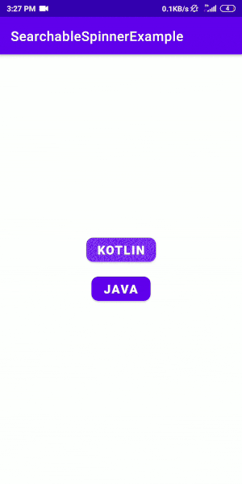
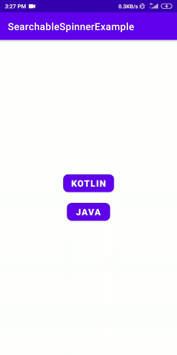
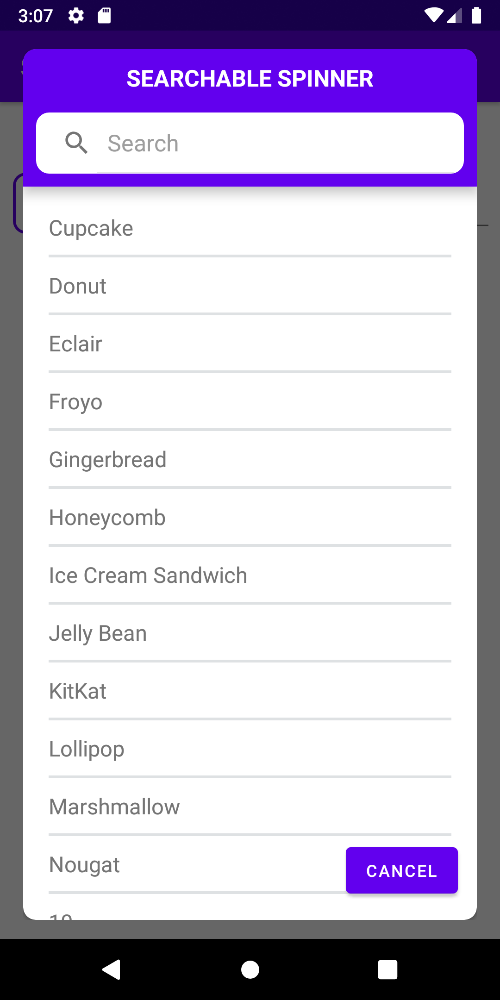

# Searchable Spinner

  
 

## Installation

#### 1). Add it in your root build.gradle:
```
allprojects {
		repositories {
			...
			maven { url 'https://jitpack.io' }
		}
	}
```
#### 2).  Add this to your module's build.gradle:
```
dependencies {
	        implementation 'com.github.leoncydsilva:SearchableSpinner:$latestSearchableSpinnerVesion'
	}
```
##### Latest SearchableSpinner version is [](https://jitpack.io/#leoncydsilva/SearchableSpinner)

## Usage Kotlin

```kotlin
val searchableSpinner = SearchableSpinner(this)
```
```
		//Optional Parameters
        searchableSpinner.windowTitle = "SEARCHABLE SPINNER"
        searchableSpinner.onItemSelectListener = object : OnItemSelectListener {
            override fun setOnItemSelectListener(position: Int, selectedString: String) {
                    textInputSpinner.editText?.setText(selectedString)
        }

        //Setting Visibility for views in SearchableSpinner
        searchableSpinner.searchViewVisibility = SearchableSpinner.SpinnerView.GONE
        searchableSpinner.negativeButtonVisibility = SearchableSpinner.SpinnerView.GONE
        searchableSpinner.windowTitleVisibility = SearchableSpinner.SpinnerView.GONE
```
```
		//Setting up list items for spinner
        val androidVersionList = arrayListOf(
            "Cupcake", "Donut", "Eclair", "Froyo", "Gingerbread", "Honeycomb", "Ice Cream Sandwich",
            "Jelly Bean", "KitKat", "Lollipop", "Marshmallow", "Nougat", "10"
        )

        searchableSpinner.setSpinnerListItems(androidVersionList)
```
```
		//Showing searchable spinner
        textInputSpinner.editText?.keyListener = null
        textInputSpinner.editText?.setOnClickListener {
            searchableSpinner.show()
        }
```

## Usage Java

```
 final SearchableSpinner searchableSpinner = new SearchableSpinner(this);
 ```
 ```
		//Optional Parameters
        searchableSpinner.setWindowTitle("SEARCHABLE SPINNER");

		//Setting up list items for spinner
        ArrayList<String> androidVersionList = new ArrayList<>(Arrays.asList("Cupcake", 			"Donut", "Eclair","Froyo", "Gingerbread", "Honeycomb", "Ice Cream Sandwich", "Jelly 		Bean", "KitKat", "Lollipop", "Marshmallow", "Nougat", "10"));
        searchableSpinner.setSpinnerListItems(androidVersionList);

        searchableSpinner.setOnItemSelectListener(new OnItemSelectListener() {
            @Override
            public void setOnItemSelectListener(int position, @NotNull String selectedString){
                    textInputSpinner.getEditText().setText(selectedString);
        });
```
```
		//Showing searchable spinner
        textInputSpinner.getEditText().setOnClickListener(new View.OnClickListener() {
            @Override
            public void onClick(View v) {
                searchableSpinner.show();
            }
        });
```

## License
[MIT](https://github.com/leoncydsilva/SearchableSpinner/blob/master/LICENSE)
